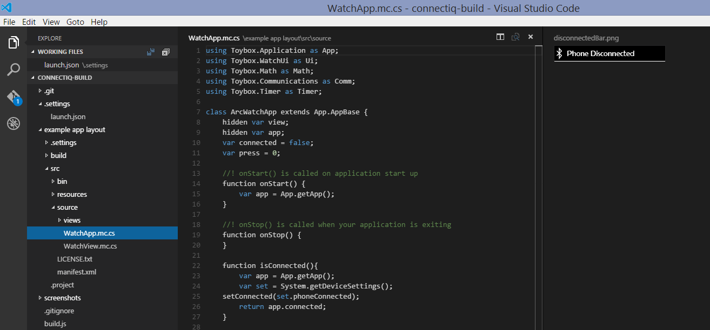
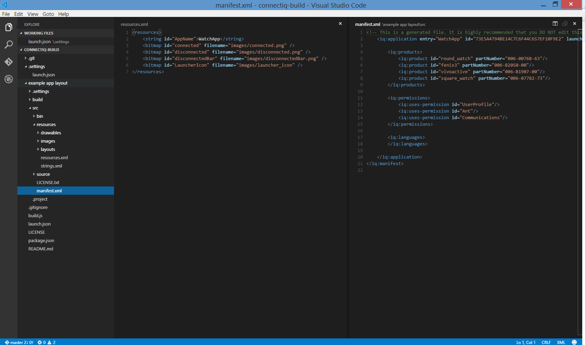
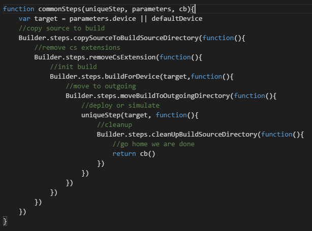
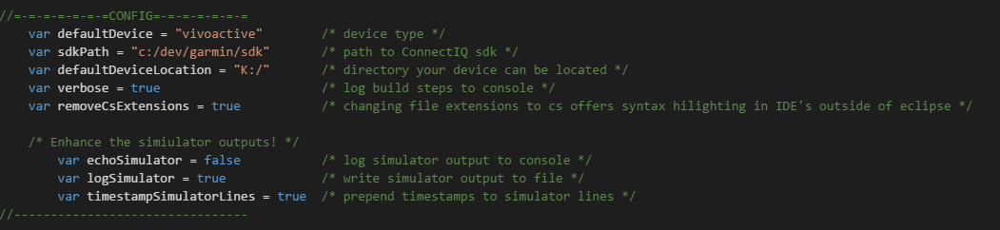
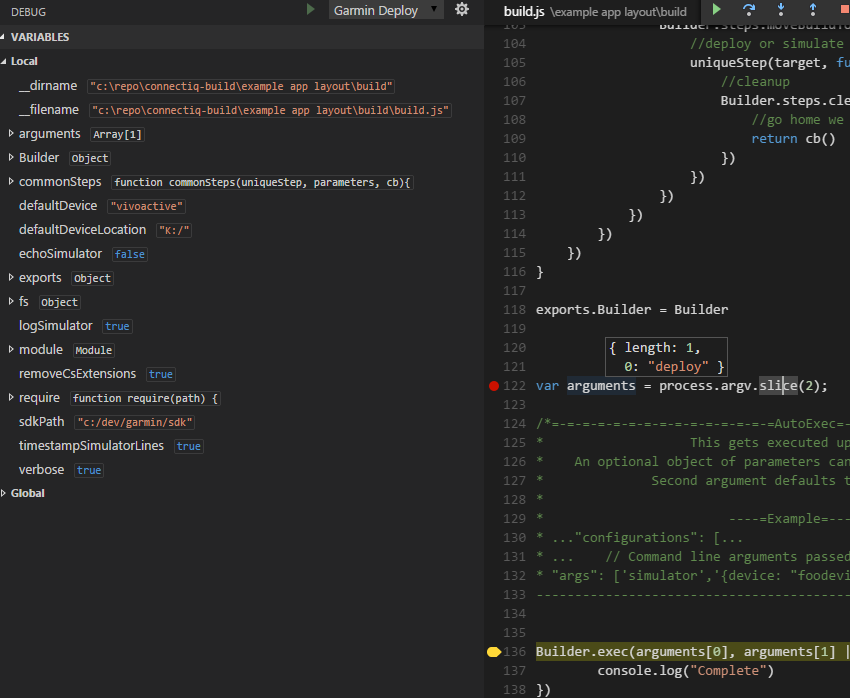
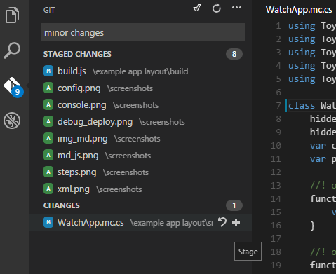
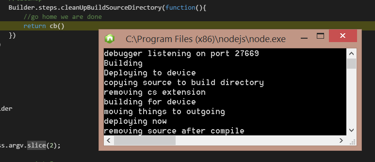

# Connect IQ | Garmin Code Builder
####Build script for building and deploying ConnectIQ apps from [Visual Studio Code](https://code.visualstudio.com/). 
######Can be adapted for other IDE's also

## I was tired of using Eclipse to build my ConnectIQ apps
I decided to experiment a bit. 
Naming the extensions of the .mc files to .cs fools the IDE into thinking the file is a C# file (would work with .java as well) See [what I mean here](example app layout/src/source/WatchApp.mc.cs) it hilights on github too. 
Next I wanted to build and deploy from within [Visual Studio Code](https://code.visualstudio.com/) so I went about looking for a way.
The debugging section will serve my purposes nicely as it will allow execution of a nodejs script and node has nice io functions.

The following is a new project structure, a sample app, and 2 methods of building. 
- Deploy to your device.
- Launch in simulator. 

### Show and Tell
####*Viewing ConnectIQ files along side images*

####*Viewing ConnectIQ files along side javascript files*

####*XML hilighting*

####*Build steps*

####*Config section of build script*

####*Debugging the deployment/simulator/build*

####*With GIT support*

####*Console output*



# Instructions
The build.js file along with the package.json file needs to live in *["your project folder/build/"](example app layout/build)*

```
Navigate to "your project folder/build/" and do an npm install
```

Your watch app needs to live in *["your project folder/src/"](example app layout/src)*

To see this in action:
- Load up this entire repo inside Visual Studio Code via the *"Open folder"* menu option.
- Navigate to the debug menu on the left bottom of the toolbar.
- Select either deploy or simulator from the debug selector at the top.
- Click the green play button.

Execution will stop at the top of your build script.

- You can either step through the steps from *[here](build.js#L1)*
- or
- Add a breakpoint *[here](build.js#L94)* and hit play to run through to completion.

This breakpoint will allow you to view the console window and the results of the build.

###Note:
There is no intellisense yet, but I'm sure that's coming soon. I might try to adapt this to sublime and add code completion.
